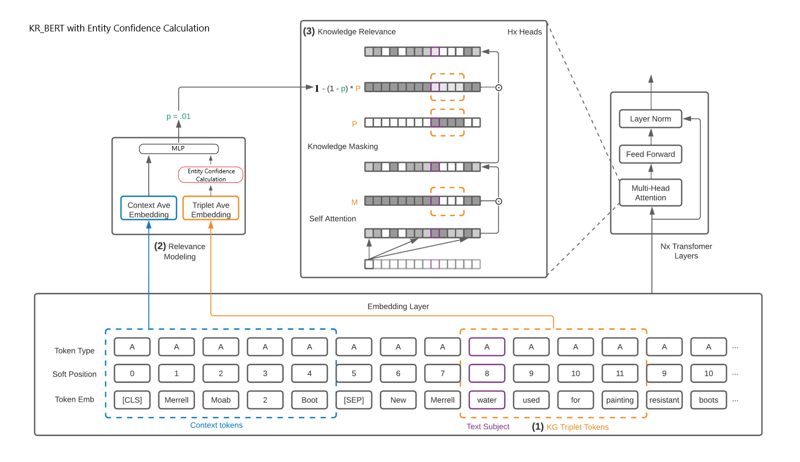
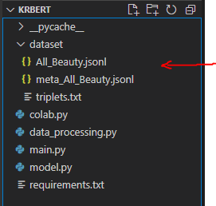

# CS274-Final-Project
Alan Chuang \
CS 274: Web Intelligence \
Prof. Teng Moh \
San Jose State University \
alan.chuang@sjsu.edu \
# KR-BERT: Advancing E-Commerce Search with Entity Confidence

This repository contains the implementation of the Knowledge Relevance BERT (KR-BERT) model for improving product-concept matching in e-commerce platforms, along with the proposed change to the existing KR-BERT architecture to include entity confidence scoring. 



## Table of Contents

1. [Introduction](#introduction)
2. [Setup and Installation](#setup-and-installation)
3. [Dataset](#dataset)
4. [Running the Project](#running-the-project)
5. [Results](#results)
6. [Contributing](#contributing)
7. [License](#license)

## Introduction

E-commerce platforms often struggle with accurately linking products to relevant concepts due to ambiguous product descriptions and noisy data. KR-BERT aims to address these challenges by incorporating knowledge graph data into BERT's architecture.

## Setup and Installation

### Prerequisites

- Dpendencies listed in `requirements.txt`

### Installation

1. **Clone the repository:**

    ```sh
    git clone https://github.com/yourusername/kr-bert.git
    cd kr-bert
    ```

2. **Create a virtual environment:**

    ```sh
    python -m venv env
    source env/bin/activate  # On Windows use `env\Scripts\activate`
    ```

3. **Install the required packages:**

    ```sh
    pip install -r requirements.txt
    ```

### Setting Up the Environment

1. **Download the dataset:**
   - Download the Amazon Reviews dataset (All-Beauty category) from [Hugging Face](https://huggingface.co/datasets/McAuley-Lab/Amazon-Reviews-2023).
     

2. **Extract the dataset:**
   - Place the `All_Beauty.jsonl` and `meta_All_Beauty.jsonl` files in a directory named `dataset` within the project root.
     

3. **Configuring Google Colab (optional):**
   - If using Google Colab, upload the dataset to Google Drive and use the provided Colab notebook to mount the drive and set paths accordingly.

## Dataset

The dataset used in this project is the Amazon Reviews dataset (All-Beauty category), which includes user reviews, item metadata, and user-item interaction graphs.

## Running the Project

### Training KR-BERT

1. **Run the baseline training script:**

    ```sh
    python main.py
    ```

2. **Run the training script with confidence scoring:**

    ```sh
    python main.py --use_confidence
    ```

3. **Parameters:**

   - You can adjust the parameters in `main.py` or pass them as arguments. For example:

    ```sh
    python main.py --epochs 5 --batch_size 32 --sample_size 10000
    ```

### Evaluating the Model

1. **Run evaluation scripts:**

    ```sh
    python evaluate.py --model_path path/to/saved_model
    ```

2. **Comparison:**
   - Compare the results with the baseline and confidence scoring enabled models.
